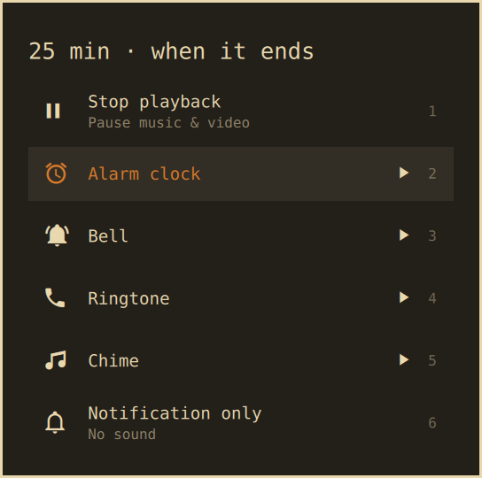

# Omarchy Timer

A countdown timer for the [Omarchy](https://omarchy.org) bar. When it ends, it can
**stop whatever is playing** (music, YouTube, a movie) or ring an alarm that keeps
going until you stop it.

Good for falling asleep to a video, steeping tea, or a quick focus block.



## Features

- **Stop playback.** Pauses every playing media player at once: Chromium, Firefox,
  Spotify, mpv, and anything else that supports MPRIS. These are the same players
  your media keys control.
- **Alarm sounds.** Alarm clock, Bell, Ringtone, or Chime. The sound loops until you
  press Esc, click the notification, or click the timer icon.
- **Notification only.** A silent notification and nothing else.
- **Styled like Omarchy.** The prompt matches Omarchy's reminder prompt. The bar icon
  sits with the other indicators next to the clock and stays hidden until a timer is
  running.
- **Pause, resume, extend, cancel.** From the bar, the popup, or the command line.
- **Survives restarts.** A running timer keeps going through a shell restart or a
  plugin reload.

## Requirements

- Omarchy 4 (the Quickshell-based `omarchy-shell` with plugin support)
- `pipewire-audio` for `pw-play` (installed on Omarchy by default)
- `sound-theme-freedesktop` for the alarm sounds (installed on Omarchy by default)

## Install

```bash
omarchy plugin add https://github.com/connilefleur/omarchy-timer.git --enable
```

Omarchy asks which bar section to use. Pick **center**. To place the icon right
next to the other indicators (reminder, night light, do not disturb), run:

```bash
omarchy bar move io.github.connilefleur.timer --after omarchy.indicators
```

## Usage

1. Hover the center of the bar to reveal the timer icon, then click it.
2. Type the minutes and press **Enter**.
3. Choose what happens when the timer ends and press **Enter** (or click a row).

While the timer runs, the bar shows the time left. Click the icon again to pause,
add time, start a new timer, or cancel.

### Durations

Minutes are the default unit, but other formats work too:

| You type  | Timer        |
| --------- | ------------ |
| `25`      | 25 minutes   |
| `1.5`     | 1 min 30 s   |
| `1h30`    | 1 h 30 min   |
| `90s`     | 90 seconds   |
| `2m30s`   | 2 min 30 s   |
| `10:00`   | 10 minutes   |

Pressing **Enter** on an empty prompt reuses your last duration.

### When the timer ends

| Option              | What happens                                                  |
| ------------------- | ------------------------------------------------------------- |
| Stop playback       | Pauses all playing media and shows a notification             |
| Alarm clock         | Loops the alarm sound until stopped                           |
| Bell                | Loops a bell until stopped                                    |
| Ringtone            | Loops a phone ringtone until stopped                          |
| Chime               | Loops a short chime until stopped                             |
| Notification only   | Shows a notification, no sound                                |

When an alarm rings, a **Timer done** card appears on the focused monitor, the
bar icon blinks, and a notification stays up until clicked. Any of these stops it:
**Esc**, **Enter**, a click on the card, the notification, or the bar icon.

### Keys in the popup

| Key                     | Action                                          |
| ----------------------- | ----------------------------------------------- |
| `Enter`                 | Confirm                                         |
| `Esc`                   | Go back or close (stops a ringing alarm)        |
| `↑` `↓` / `j` `k` / Tab | Move through the list                           |
| `1`–`6`                 | Choose a row directly                           |
| `Space`                 | Preview the highlighted alarm sound             |
| `Backspace`             | Edit the minutes / go back a step               |

### Mouse on the bar icon

| Action       | Idle                        | Running / paused        | Ringing    |
| ------------ | --------------------------- | ----------------------- | ---------- |
| Left click   | Set a timer                 | Manage the timer        | Stop alarm |
| Right click  | Restart the last timer      | Pause / resume          | Stop alarm |
| Middle click |                             | Cancel                  | Stop alarm |
| Scroll       |                             | Add / remove one minute |            |

## Keybinding

Open the timer prompt from the keyboard by adding a binding to
`~/.config/hypr/bindings.lua`:

```lua
o.bind("SUPER + ALT + T", "Timer", "omarchy-shell io.github.connilefleur.timer open")
```

## Command line

Every action is also available over shell IPC, for scripts and keybindings:

```bash
omarchy-shell io.github.connilefleur.timer open                     # show the prompt
omarchy-shell io.github.connilefleur.timer start 25                 # start with the last alarm choice
omarchy-shell io.github.connilefleur.timer startWith 45 stop-playback
omarchy-shell io.github.connilefleur.timer restart                  # repeat the last timer
omarchy-shell io.github.connilefleur.timer toggle                   # pause / resume
omarchy-shell io.github.connilefleur.timer add 5                    # add 5 minutes
omarchy-shell io.github.connilefleur.timer cancel
omarchy-shell io.github.connilefleur.timer stop                     # stop a ringing alarm
omarchy-shell io.github.connilefleur.timer status                   # JSON
omarchy-shell io.github.connilefleur.timer alarms                   # list alarm ids
```

Alarm ids: `stop-playback`, `alarm-clock`, `bell`, `ringtone`, `chime`, `silent`.

## Configure

The bar entry in `~/.config/omarchy/shell.json` accepts one setting:

| Key          | Default | Description                                            |
| ------------ | ------- | ------------------------------------------------------ |
| `alwaysShow` | `false` | Keep the idle icon visible instead of hiding it        |

```bash
omarchy bar set io.github.connilefleur.timer alwaysShow true --json
```

Move the icon like any other widget:

```bash
omarchy bar move io.github.connilefleur.timer --section right
```

## How it works

- `Service.qml` holds the single timer shared by every monitor's bar. It counts
  down against the wall clock, so time spent in suspend still counts.
- **Stop playback** calls `pause()` on every playing MPRIS player through
  Quickshell's MPRIS service. Players that don't support MPRIS are not affected.
- Sounds come from `/usr/share/sounds/freedesktop/stereo/` and play through `pw-play`.
- Notifications go through `omarchy-notification-send`.
- The timer state is saved in `~/.local/state/omarchy/timer.json`.

The plugin makes no network requests and never needs `sudo`.

## Update

```bash
omarchy plugin update io.github.connilefleur.timer
```

## Remove

```bash
omarchy plugin remove io.github.connilefleur.timer
rm -f ~/.local/state/omarchy/timer.json   # optional: forget the saved state
```

## Files

```
manifest.json    Plugin manifest (schemaVersion 1)
Service.qml      Timer state, alarms, media control, persistence, IPC
BarWidget.qml    Bar icon and countdown
Flow.qml         Set-timer prompt, manage list, and "Timer done" card
TimerModel.js    Duration parsing, formatting, and the alarm list
```

## License

[MIT](LICENSE)
